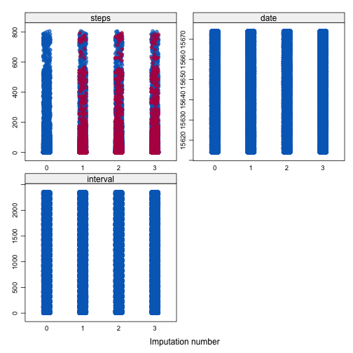
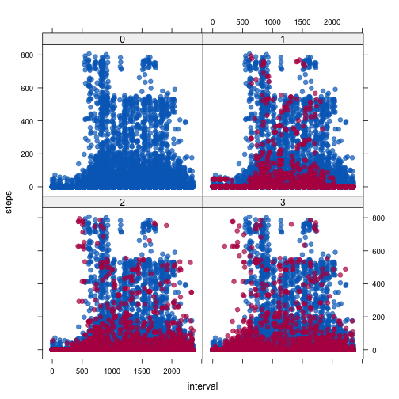

## Review of Personal Monitoring Device

Due to the ever increasing capacity to collect large amounts of data, personal data devices such as Fitbit and Jawbone are increasing becoming a part of everyday life.  These particular devices take measurments in the quest to find behavior patterns and to improve ones health.  

The review uses data from a personal activity device that collected data at 5 minute intervals, during the month of October and November 2012. 
<!-- For more info on RMarkdown see http://rmarkdown.rstudio.com/ -->

### Data

The data variables include:

* steps - Number of steps taken in 5 minute intervals.
* date - A date the measurements were taken.
* interval - 5 minute interval identifier.

### Data Processing
  

```r
library("data.table") # Data storage.
library("assertthat") # Useful test.
library("chron")      # Convenient date storage.
library("Hmisc")      # Check attributes.
library("mice")       # mice imputation. 
```

```r
# List of options.
Sys.setlocale()
```

```
## [1] "en_US.UTF-8/en_US.UTF-8/en_US.UTF-8/C/en_US.UTF-8/en_US.UTF-8"
```

```r
op <- options()
options(digits = 3)    
```
The analysis begins by defining a monitor object which contain member variables and functions that are members of the monitor class.

```r
# Monitor class definition and functions.
getName <- function(.Object) {return(.Object@activityName)}
getActivity <- function(.Object) {return(.Object@activity)}
getClass <- function(.Object) {return(sapply(.Object@activity, class))}
summary <- function(.Object) {
  # Calculates mean, median, and total number of steps each day.
  # Total steps per day with NAs and zeros removed.
  # Zeros removed to facilitate median calculations.
  .Object@activity[!is.na(steps) & (steps > 0), 
                                   .(count = .N,
                                   steps = sum(steps),
                                   min = min(steps),
                                   max = max(steps),
                                   mean = mean(steps),
                                   median = median(steps)),
                                   by = date]
}
# totalMissing returns number of NAs. 
totalMissing <- function(.Object) {return(sum(is.na(.Object@activity)))}

setClass(
  Class = "Monitor", 
  slots = c(
    name = "character", 
    activity = "data.table"
  )
)
setGeneric(
  name = "activityNms", 
  def = function(.Object) {standardGeneric("activityNms")}
)
```

```
## [1] "activityNms"
```

```r
setMethod("activityNms",signature("Monitor"), getName)
```

```
## [1] "activityNms"
```

```r
setMethod("activityNms",signature("Monitor"), getActivity)
```

```
## [1] "activityNms"
```

```r
setMethod("activityNms",signature("Monitor"), getClass)
```

```
## [1] "activityNms"
```

```r
setMethod("initialize", "Monitor", function(.Object, ...) {
  .Object <- callNextMethod()
  # Automatically sets classes on object construction. 
  # as.chron reads dates as numeric.                                           
  .Object@activity[,date := as.chron(as.IDate(date))] 
  .Object@activity[,steps := as.numeric(steps)]
  .Object@activity[,interval := as.numeric(interval)]
  # Create weekday and weekend variables. 
  .Object@activity[,wkdy := weekdays(date, abbreviate = TRUE)]
  .Object@activity[,day := {ifelse(weekdays(date) == "Sat","weekend",
          ifelse(weekdays(date) == "Sun", "weekend", "weekday"))},]
  # Factor variables.
  .Object@activity[,day := factor(day)]
  .Object@activity[, wkdy := factor(wkdy)]
  .Object
})
```

```
## [1] "initialize"
```

```r
setMethod("activityNms",signature("Monitor"), summary)
```

```
## [1] "activityNms"
```

```r
setMethod("activityNms",signature("Monitor"), totalMissing)
```

```
## [1] "activityNms"
```


```r
createDir <- function(dir_name, file_name) {
  # Create directory to hold downloaded file.
  if(!file.exists(dir_name)) {
    dir.create(dir_name)
  }
  # Unzip file into data directory.
  if(file.exists(file_name) & has_extension(file_name, "zip")) {
    unzip(zipfile = file_name, exdir = path.expand(dir_name))
    list.files(dir_name)
    return(TRUE)
  }
}
# Read dataset function.
loadDataset <- function(input, ...) {
  dataset = NULL
  try(dataset <- fread(input = input, ...), silent = TRUE)
  cat(sprintf("Processing dataset...\n"))
  return(dataset)
}
# Read data into monitor class.
monitorDv <- function(activity) {
  if(missing(activity)) {
    createDir("data", "repdata-data-activity.zip")  
    data <- loadDataset("./data/activity.csv", header = TRUE, sep = ",")
    new(Class = "Monitor", activity = data)  
  }
  else {
    new(Class = "Monitor", activity = activity)
  }
}
```

### Load data

```r
# Construct a personal activity monitor device.
pamd <- monitorDv()
```

```
## Processing dataset...
```

```r
# Return activity data.
activity <- getActivity(pamd)
```

### Check data

```r
getClass(pamd)
```

```
## $steps
## [1] "numeric"
## 
## $date
## [1] "dates" "times"
## 
## $interval
## [1] "numeric"
## 
## $wkdy
## [1] "ordered" "factor" 
## 
## $day
## [1] "factor"
```

```r
dim(activity)
```

```
## [1] 17568     5
```

```r
names(activity)
```

```
## [1] "steps"    "date"     "interval" "wkdy"     "day"
```
### Mean total number of steps per day

```r
# Returns mean and median calculations of total number of steps per day.
(s <-summary(pamd))
```

```
##         date count steps min max  mean median
##  1: 10/02/12     2   126   9 117  63.0   63.0
##  2: 10/03/12    81 11352   4 613 140.1   61.0
##  3: 10/04/12   100 12116   1 547 121.2   56.5
##  4: 10/05/12    86 13294   2 555 154.6   66.0
##  5: 10/06/12   106 15420   4 526 145.5   67.0
##  6: 10/07/12   108 11015   7 523 102.0   52.5
##  7: 10/09/12    95 12811   3 748 134.9   48.0
##  8: 10/10/12   104  9900   7 413  95.2   56.5
##  9: 10/11/12    75 10304   4 748 137.4   35.0
## 10: 10/12/12   111 17382   2 802 156.6   46.0
## 11: 10/13/12   104 12426   6 542 119.5   45.5
## 12: 10/14/12    94 15098   1 540 160.6   60.5
## 13: 10/15/12    77 10139   2 786 131.7   54.0
## 14: 10/16/12    96 15084   4 758 157.1   64.0
## 15: 10/17/12    88 13452   3 744 152.9   61.5
## 16: 10/18/12    66 10056   4 759 152.4   52.5
## 17: 10/19/12    93 11829   1 512 127.2   74.0
## 18: 10/20/12    83 10395   4 532 125.2   49.0
## 19: 10/21/12    91  8821   1 501  96.9   48.0
## 20: 10/22/12    87 13460   3 783 154.7   52.0
## 21: 10/23/12    88  8918   4 499 101.3   56.0
## 22: 10/24/12    80  8355   4 533 104.4   51.5
## 23: 10/25/12    44  2492   4 443  56.6   35.0
## 24: 10/26/12    88  6778   6 440  77.0   36.5
## 25: 10/27/12    75 10119   2 555 134.9   72.0
## 26: 10/28/12   104 11458   2 533 110.2   61.0
## 27: 10/29/12    62  5018   4 591  80.9   54.5
## 28: 10/30/12    89  9819   4 523 110.3   40.0
## 29: 10/31/12    86 15414   6 757 179.2   83.5
## 30: 11/02/12    74 10600   6 753 143.2   55.5
## 31: 11/03/12    90 10571   5 533 117.5   59.0
## 32: 11/05/12    74 10439   7 785 141.1   66.0
## 33: 11/06/12    83  8334   5 630 100.4   52.0
## 34: 11/07/12    95 12883   1 766 135.6   58.0
## 35: 11/08/12    52  3219   7 359  61.9   42.5
## 36: 11/11/12    95 12608   4 540 132.7   55.0
## 37: 11/12/12    69 10765   2 542 156.0   42.0
## 38: 11/13/12    81  7336   2 444  90.6   57.0
## 39: 11/15/12     2    41   8  33  20.5   20.5
## 40: 11/16/12    61  5441   2 475  89.2   43.0
## 41: 11/17/12    78 14339   6 753 183.8   65.5
## 42: 11/18/12    93 15110   4 785 162.5   80.0
## 43: 11/19/12    75  8841   4 789 117.9   34.0
## 44: 11/20/12    47  4472   6 500  95.1   58.0
## 45: 11/21/12    68 12787   7 758 188.0   55.0
## 46: 11/22/12   115 20427   1 567 177.6   65.0
## 47: 11/23/12    84 21194   8 760 252.3  113.0
## 48: 11/24/12    82 14478   6 785 176.6   65.5
## 49: 11/25/12    84 11834   7 551 140.9   84.0
## 50: 11/26/12    87 11162   4 709 128.3   53.0
## 51: 11/27/12    86 13646   6 806 158.7   57.0
## 52: 11/28/12    48 10183   4 733 212.1   70.0
## 53: 11/29/12    64  7047   8 568 110.1   44.5
##         date count steps min max  mean median
```

```r
# Histogram of total number of steps each day
(stp <- hist(s$steps, breaks = "Sturges", plot = FALSE))
```

```
## $breaks
## [1]     0  5000 10000 15000 20000 25000
## 
## $counts
## [1]  5 12 28  6  2
## 
## $density
## [1] 1.89e-05 4.53e-05 1.06e-04 2.26e-05 7.55e-06
## 
## $mids
## [1]  2500  7500 12500 17500 22500
## 
## $xname
## [1] "s$steps"
## 
## $equidist
## [1] TRUE
## 
## attr(,"class")
## [1] "histogram"
```

```r
plot(stp, border = "black", col = "limegreen", 
     main = "Histogram of total steps",
     xlab = "Number of Steps", labels = TRUE,
     ylim=c(0, 30))
     # Distribution of values, jittered. 
     rug(jitter(s$steps, amount = 0.01))
```

 

### Average daily pattern

```r
# Time series plot of 5 minute interval averaged over number of steps.
a <- activity[!is.na(steps), .(steps = mean(steps)), by = interval]
par(lty = 1, pch = 19)
plot(a$steps ~ a$interval, 
     type = "l", lwd = 1.3, col = "darkgreen",
     main = "Average daily steps activity",
     sub = "5 minute intervals",
     xlab = "Interval", ylab = "Number of Steps (averaged)", bg = "seashell")
```

 

```r
# 5-minute interval, on average across all the days in the dataset, contains the maximum number of steps.
a[which.max(a$steps),]
```

```
##    interval steps
## 1:      835   206
```


### Imputation

```r
# Return number of rows that contain NAs. 
totalMissing(pamd)
```

```
## [1] 2304
```

```r
sum(activity[,!complete.cases(activity)])
```

```
## [1] 2304
```

```r
library("VIM")
```

```
## Loading required package: colorspace
```

```
## Warning: package 'colorspace' was built under R version 3.1.3
```

```
## VIM is ready to use. 
##  Since version 4.0.0 the GUI is in its own package VIMGUI.
## 
##           Please use the package to use the new (and old) GUI.
## 
## Suggestions and bug-reports can be submitted at: https://github.com/alexkowa/VIM/issues
## 
## Attaching package: 'VIM'
## 
## The following object is masked from 'package:datasets':
## 
##     sleep
```

```r
aggr(activity, prop = FALSE, numbers = TRUE)
```

 

```r
# Imputation
# Another way to count missing values.
md.pattern(activity)
```

```
##       date interval wkdy day steps     
## 15264    1        1    1   1     1    0
##  2304    1        1    1   1     0    1
##          0        0    0   0  2304 2304
```

```r
# Multiple imputation with chain equations to calculate missing values.
# One method is to use predictive mean matching (pmm), which is the default for numerical values for mice. 
# Dry run in order to change default values.
ini <- mice(activity, maxit = 0)
pred <- ini$predictorMatrix
# Remove weekend and weekday variables as predictors.
pred[, "day"] <- 0
pred[, "wkdy"] <- 0
# Create 3 multiple imputations and store datasets in imp object.
imp <- mice(activity, pred = pred, pri = FALSE, m = 3, seed = 4321)
```


```r
# Steps imputation stored here. 
# Each column represents the three imputted dataset.
# Show the first ten rows.
imp$imp$steps[1:10,]
```

```
##     1 2  3
## 1   0 0  0
## 2   0 0  0
## 3   0 0  0
## 4   0 0  0
## 5   0 0  0
## 6  47 0  0
## 7   0 0  0
## 8   0 0  0
## 9  47 0 19
## 10  0 0  0
```


```r
# A scatterplot and stripplot are drawn that combines steps and interval for each imputted dataset.
# Red points represent the imputted values while blue points represent the observed values.
# The red points practically overlap the blue points leading to possible measurements.  
# However, additional tests should be carried out to validate the measurements.
stripplot(imp, pch = 20, cex = 1.2)
```

 

```r
xyplot(imp, steps ~ interval | .imp, pch = 20, cex = 1.4)
```

 

```r
# A new dataset with missing data filled in is created.
# The complete dataset includes inputted data with observed data.
# The first dataset is selected.
comDt <- as.data.table(complete(imp, 1))
```

```r
# Mean and median calculation using imputted data.
(s1 <- comDt[(steps > 0), 
            .(
            mean = mean(steps),
            median = median(steps),
            steps = sum(steps)
            ), 
            by = date])
```

```
##         date  mean median steps
##  1: 10/01/12 114.4   50.5  8693
##  2: 10/02/12  63.0   63.0   126
##  3: 10/03/12 140.1   61.0 11352
##  4: 10/04/12 121.2   56.5 12116
##  5: 10/05/12 154.6   66.0 13294
##  6: 10/06/12 145.5   67.0 15420
##  7: 10/07/12 102.0   52.5 11015
##  8: 10/08/12 151.1   69.5 10576
##  9: 10/09/12 134.9   48.0 12811
## 10: 10/10/12  95.2   56.5  9900
## 11: 10/11/12 137.4   35.0 10304
## 12: 10/12/12 156.6   46.0 17382
## 13: 10/13/12 119.5   45.5 12426
## 14: 10/14/12 160.6   60.5 15098
## 15: 10/15/12 131.7   54.0 10139
## 16: 10/16/12 157.1   64.0 15084
## 17: 10/17/12 152.9   61.5 13452
## 18: 10/18/12 152.4   52.5 10056
## 19: 10/19/12 127.2   74.0 11829
## 20: 10/20/12 125.2   49.0 10395
## 21: 10/21/12  96.9   48.0  8821
## 22: 10/22/12 154.7   52.0 13460
## 23: 10/23/12 101.3   56.0  8918
## 24: 10/24/12 104.4   51.5  8355
## 25: 10/25/12  56.6   35.0  2492
## 26: 10/26/12  77.0   36.5  6778
## 27: 10/27/12 134.9   72.0 10119
## 28: 10/28/12 110.2   61.0 11458
## 29: 10/29/12  80.9   54.5  5018
## 30: 10/30/12 110.3   40.0  9819
## 31: 10/31/12 179.2   83.5 15414
## 32: 11/01/12 132.2   51.5  8459
## 33: 11/02/12 143.2   55.5 10600
## 34: 11/03/12 117.5   59.0 10571
## 35: 11/04/12  82.5   50.5  5277
## 36: 11/05/12 141.1   66.0 10439
## 37: 11/06/12 100.4   52.0  8334
## 38: 11/07/12 135.6   58.0 12883
## 39: 11/08/12  61.9   42.5  3219
## 40: 11/09/12 154.7   54.5 10207
## 41: 11/10/12 133.9   70.0  9644
## 42: 11/11/12 132.7   55.0 12608
## 43: 11/12/12 156.0   42.0 10765
## 44: 11/13/12  90.6   57.0  7336
## 45: 11/14/12 124.3   57.0  8204
## 46: 11/15/12  20.5   20.5    41
## 47: 11/16/12  89.2   43.0  5441
## 48: 11/17/12 183.8   65.5 14339
## 49: 11/18/12 162.5   80.0 15110
## 50: 11/19/12 117.9   34.0  8841
## 51: 11/20/12  95.1   58.0  4472
## 52: 11/21/12 188.0   55.0 12787
## 53: 11/22/12 177.6   65.0 20427
## 54: 11/23/12 252.3  113.0 21194
## 55: 11/24/12 176.6   65.5 14478
## 56: 11/25/12 140.9   84.0 11834
## 57: 11/26/12 128.3   53.0 11162
## 58: 11/27/12 158.7   57.0 13646
## 59: 11/28/12 212.1   70.0 10183
## 60: 11/29/12 110.1   44.5  7047
## 61: 11/30/12 165.8   54.0 12935
##         date  mean median steps
```

```r
# Histogram of imputted data.
(stp <- hist(s1$steps, breaks = "Sturges", plot = FALSE))
```

```
## $breaks
## [1]     0  5000 10000 15000 20000 25000
## 
## $counts
## [1]  5 17 31  6  2
## 
## $density
## [1] 1.64e-05 5.57e-05 1.02e-04 1.97e-05 6.56e-06
## 
## $mids
## [1]  2500  7500 12500 17500 22500
## 
## $xname
## [1] "s1$steps"
## 
## $equidist
## [1] TRUE
## 
## attr(,"class")
## [1] "histogram"
```

```r
plot(stp, border = "black", col = "limegreen", 
     main = "Histogram of total steps", 
     xlab = "Number of Steps", labels = TRUE,
     ylim=c(0, 35))
     rug(jitter(s1$steps, amount = 0.01))
```

 

```r
# Values in the range of 5000 to 15000 steps have increased. 
# One result of imputting missing data is the ability to use more data thus leading to a 
# more complete assessment.
```

### Activity patterns on weekend and weekdays


```r
# Dataset with imputted variables.
s2 <- comDt[, 
     .(
     steps = sum(steps)
     ), 
     by = .(interval, day)]
```

```r
xyplot(steps ~ interval | day,
    data = s2, 
    layout = c(1,2),
    panel = function(x, y) {
    panel.grid(h = -1, v = 2)
    panel.xyplot(x, y, type = "l")
})
```

 

